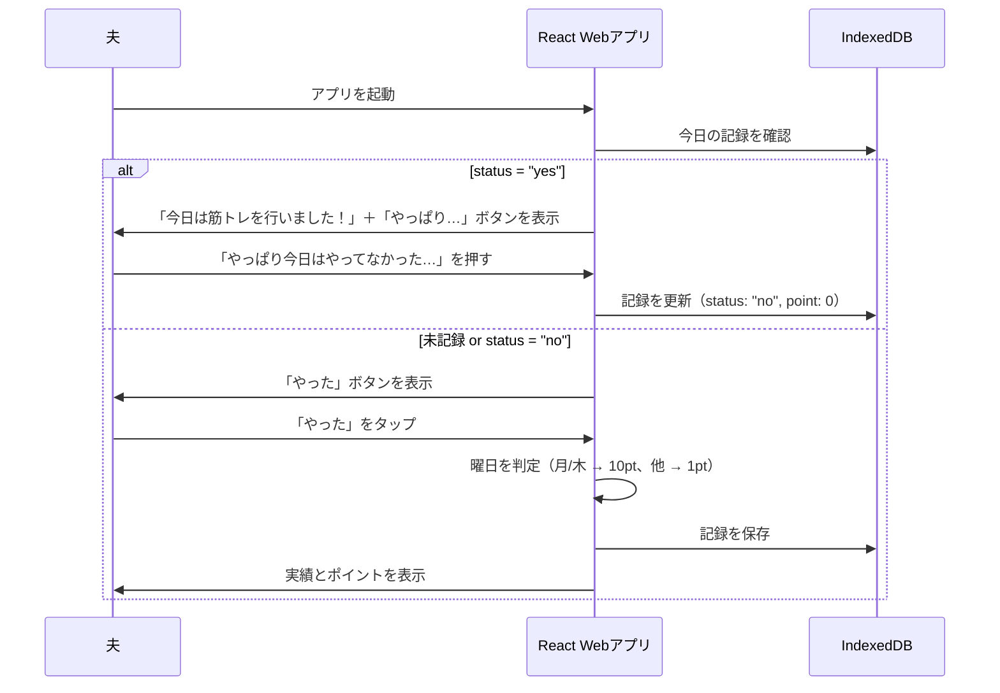

# 筋トレ記録アプリ「筋メモ」

忙しい夫が、筋トレを継続できるように。  
ちょっとしたご褒美で、楽しみながら習慣化できるように。  
夫専用の、**世界でひとつの記録アプリです。**

---

## 🎯 概要

このアプリは、夫のために開発するシンプルな筋トレ記録アプリです。  
「今日筋トレをやったかどうか」をワンタップで記録し、月間・累計の回数とポイントを表示します。  
月曜と木曜はポイント10倍となるインセンティブ付きで、継続モチベーションを高めます。  
リアルなご褒美制度との連携もあり、楽しく続けられる仕組みになっています。

---

## 👨‍💻 想定ユーザー

- 利用者は **1名（夫のみ）**
- ログイン・アカウント管理は不要
- **Androidユーザー（通知/PWA対応あり）**

---

## ✅ 機能一覧

### 🔹 記録機能

- 起動時に当日の記録状態を確認
- 未記録であれば「✅ やった！」ボタンを表示
- ボタンを押すと、その日の記録を `status: "yes"` として保存
- 曜日を判定して、ポイントを付与（月曜・木曜は10pt、それ以外は1pt）

### 🔹 誤操作対応

- すでに記録済み（status: "yes"）の場合：
  - 「今日は筋トレを行いました！」という表示
  - 「やった」ボタンは非表示
  - 「↩️ やっぱり今日はやってなかった…」ボタンで取消＆ポイント差し引き

### 🔹 達成状況表示

- 今月の「やった日数」を表示
- 累計の「やった日数」も表示

### 🔹 ポイント機能

- 通常：1ポイント／日
- 月曜・木曜：10ポイント（ボーナスデー）
- 累計ポイント表示
- 累計ポイント × 10円として「◯円相当」と表示
- リアルで手渡すため交換機能は不要

### 🔹 通知機能（Web通知）

- 毎日20:00にWeb Push通知を送信（Androidのみ対応）
- 通知内容：「今日の筋トレ、記録しましたか？」
- 通知許可があれば自動で送信
- PWAとしてホーム画面追加後も通知が継続

---

## 💡 起動時の画面分岐（UIイメージ）

### 🟢 今日未記録の場合
[✅ やった！]    

今月の筋トレ回数：4回  
累計回数：19回  
累計ポイント：520pt（¥520 相当）

### 🔵 今日すでに「やった」と記録済みの場合

🎉 今日は筋トレを行いました！

[↩️ やっぱり今日はやってなかった…]

今月の筋トレ回数：5回  
累計回数：20回  
累計ポイント：530pt（¥530 相当）

---

## 🗂 データベース構成（IndexedDB）

### `records` ストアの構造（キー：日付文字列）

| フィールド名 | 型       | 説明                         |
|--------------|----------|------------------------------|
| date         | string   | `YYYY-MM-DD` 形式の日付（キー）|
| status       | string   | `"yes"` / `"no"`              |
| point        | number   | 1 or 10                       |
| created_at   | datetime | JavaScript の ISO 形式日時   |

※ IndexedDB内で `records` ストアとして保持

## 🔁 シーケンス図（Mermaid形式）



## 📲 バックアップ方法

- 保存データは IndexedDB にあるため、機種変更時は開発者が対応
- JSON形式でエクスポート／インポート可能
- 操作は開発者が開発者ツール or 特設メニューで実施

## ⚙️ 技術構成・開発方針（React × Android）

| 項目             | 技術 / ツール            | 内容                                                   |
|------------------|---------------------------|--------------------------------------------------------|
| フロント         | React（Vite推奨）         | 学習しやすく、高速で構築できる                       |
| 状態管理         | useState / useEffect       | 最小限の状態管理で実装                                |
| データ保存       | IndexedDB（idbライブラリ）  | ブラウザ間の移行が容易、大容量データ対応可能          |
| PWA対応          | Workbox                   | Service Worker実装の簡略化、オフライン対応、ホーム画面インストール |
| 通知             | Web Push API              | Androidでは対応OK。20:00に通知                        |
| デプロイ         | Netlify（無料）           | GitHub連携でデプロイ。URLは夫にだけ共有               |
| 認証             | JavaScriptで簡易制限       | パスワード入力で認証（非公開運用）                    |
| スタイリング     | DaisyUI（cupcakeテーマ）   | 親しみやすく、筋トレアプリに適したデザイン。柔らかい印象の配色と丸みを帯びたデザイン要素 |

## 📱 PWA対応詳細

### 🔹 基本設定
- アプリ名：筋メモ
- ショート名：筋メモ
- テーマカラー：#65c3c8（cupcakeテーマに合わせる）
- 背景色：#faf7f5
- アイコンサイズ：192x192, 512x512

### 🔹 機能
- ホーム画面へのインストール
- オフライン対応
- プッシュ通知
- アプリ起動時のスプラッシュ画面

### 🔹 オフライン対応
- アプリケーションシェル（UI）のキャッシュ
- 記録データのオフライン保存
- オフライン時の通知表示

## 💾 データベース設計（IndexedDB）

### 🔹 records ストア
| フィールド名 | 型       | 説明                         |
|--------------|----------|------------------------------|
| date         | string   | `YYYY-MM-DD` 形式の日付（キー）|
| status       | string   | `"yes"` / `"no"`              |
| point        | number   | 1 or 10                       |
| created_at   | datetime | JavaScript の ISO 形式日時   |

### 🔹 データ操作
- インデックス：date
- トランザクション：readwrite
- バージョン管理：1から開始

## 📲 データ移行・バックアップ機能

### 🔹 エクスポート機能
- 全データをJSON形式でエクスポート
- ファイル名：`muscle-training-records_YYYY-MM-DD.json`
- IndexedDBからのデータ取得

### 🔹 インポート機能
- JSONファイルからのデータ復元
- 既存データとの競合チェック
- インポート前のバックアップ作成

### 🔹 エラーハンドリング
- データベース接続エラー
- トランザクションエラー
- ストレージ容量不足
- オフライン時の動作

---
## 🔐 アクセス制限（非公開運用）
```js
const pw = prompt("パスワードを入力してください");
if (pw !== "secret-password") {
  alert("アクセスできません");
  document.body.innerHTML = "";
}
```
- URLを夫にだけ共有すれば、他人はアクセス不可
- robots.txt で検索避け (Disallow: /)
---

## 🔮 今後の拡張候補（任意）

- カレンダー形式の記録履歴
- 月ごとの目標設定と達成率表示
- ボイス応援機能（自作メッセージ再生）
- ご褒美の交換履歴機能（手動記録）

---
## 📋 実装詳細仕様

### 🔹 UI/UX方針

#### 記録操作
- 「やった！」ボタンタップ時に確認ダイアログ表示
- 確認メッセージ：「本当に記録する？」
- キャンセル時は操作を取り消し

#### 通知仕様
- 固定送信時刻：毎日20:00
- 通知音なし
- タップ時はホーム画面に遷移
- 当日未記録時のみ通知

### 🔹 運用ルール

#### 日付・時間の定義
- 日付の区切り：深夜0時
- 月の区切り：1日0時
- 記録の修正期限：当日23:59まで
- 通知時刻：20:00（日本時間）

#### バックアップ
- 頻度：月1回程度の手動バックアップ
- 方法：JSONファイルのエクスポート/インポート
- タイミング：月初めの任意のタイミング

#### セキュリティ
- パスワード：固定パスワード（シンプルな文字列）
- パスワード紛失時：開発者に直接連絡

#### トラブル対応
- 通知不達：ブラウザの通知設定を確認
- データ消失：バックアップからの復旧
- その他：開発者に直接連絡

#### 機能制限
- ポイントの上限：なし
- 通知設定：変更不可
- 通知の一時停止：機能なし